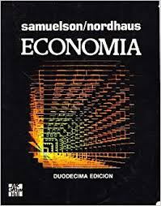

<style>

li {
  margin-bottom: 20px;

}

.remark-slide-content {

  height: 200px;
}
</style>

```{r setup, include=FALSE}
options(htmltools.dir.version = FALSE)
knitr::opts_chunk$set(echo = TRUE, echo = FALSE, warning = FALSE)
library(ggplot2)
library(tidyverse)
library(dplyr)
library(cowplot)
library(knitr)
library(kableExtra)

theme_set(
  theme_classic() + 
    theme(
      plot.title = element_text(hjust = 0.5)
    ))

```

# Introducción a la Economía


- Lunes y Miércoles 7:50

---
# Docente

- Rafael La Buonora 
  - rafael.labuonora@stbrendan.edu.uy

- Economista
  - Ministerio de Industria, Economía
  - Oficina de Planeamiento y Presupuesto
  - [Comisión de Expertos en Seguridad Social](www.cess.gub.uy)


---
# Objetivos del curso

- Presentar las principales herramientas de la ciencia economómica para entender el mundo.
- Dar un panorama de qué hacen los economistas.

---

# Recursos (1)


- Google Classroom
  - Materiales
  - Cuestionarios
  - Foro
  - Link para clases via Google Meet
  
  
- Sitio web [](econ.rlabuonora.com)
  - Linkeado desde classroom
  
- Mail (rafael.labuonora@stbrendan.edy.uy)

---

# Recursos(2)

- Diapositivas
  - Linkeadas desde el classroom.
  - Tienen un resúmen de lo que tienen que saber.
  - Pueden no tener el nivel de detalle necesario para entender todo.
---

# Recursos (3)

Samuelson



- Cualquier edición sirve
- Hay una versión que se llama Macroeconomía con aplicaciones para América Latina. Faltan algunos capítulos.


---
# Evaluación

- Participación en clase
  - Preguntas
  - Resupuestas
  - Ejercicios (estan en la web)
- Escrito
  - 2 escritos
  - 2 parciales
  - 1 trabajo 
    - 1 página de análisis de material de prensa/web en base a las ideas del curso.

---

# ¿Qué estudia la economía?

Algunas preguntas que busca responder la economía:

- ¿Por qué algunos países son más ricos que otros?
- ¿Cómo se determina el salario de los trabajadores?
- ¿Qué medidas debe tomar el gobierno para mejorar el bienestar de la población?
- ¿Qué efectos tiene el comercio entre países?

---

# Conceptos Clave

- Economía normativa y economía positiva.
- Macroeconomía y microeconomía.
- Escasez y eficiencia.

<!-- --- -->


---
# Los principales problemas que enfrenta la economía

- ¿Qué producir?

Economías con __estructura productivas__ diferentes.

- ¿Cómo producir?

Economías disponen de diferentes __tecnologías__.

- ¿Para quién producir?

__Distribución__ del producto de la economía.

---
# Método: ¿Cómo estudia la economía?

- La economía como ciencia.
- Teorías científicas.
- Matemática: el lenguaje de la ciencia.
  - Variables
  - Ecuaciones
  - Funciones

---
# El lenguaje de la ciencia: Variables

- Las ventas de una empresa (precios, cantidades, ventas).
- La cantidad de empleos en una economía.
- El valor de las exportaciones de un país.

---
# El lenguaje de la ciencia: Ecuaciones

$$ Beneficios = Ingresos - Costos $$
$$ PIB = PIB_{Agro} + PIB_{Industria} + PIB_{Servicios}$$
$$ Consumo = f(Ingreso)$$
---
# El lenguaje de la ciencia: Funciones

$$Producción = f(Trabajadores)$$
$$ Demanda = Q_d(Precio, Ingresos, ...)$$

---

# Economías Mixtas

- Las economías modernas don __economías **mixtas**__ 
- Combinan dos mecanismos para asignar recursos:
  - El mercado
  - El estado

---

# El mercado

.pull-left[
- Reúne compradores (demanda) y vendedores (oferta).
- Coordina millones de agentes __descentralizadamente__.
- Determinan el precio de un bien y la cantidad vendida

]

.pull-right[
  

]


---
# Mercado y Precios 

.pull-left[


]

.pull-right[

- Adam Smith fue el primero en entender el papel de los mercados en este proceso.
- Funcionan como señales para que los agentes económicos tomen decisiones.
- Estas decisiones determinan qué, cómo y para quién se produce.

]


---
## El mercado como mecanismo de asignación de recursos

- Un mercado es el marco en el que interactúan los *oferentes* y los *demandantes* de un bien, que son los que deciden cuanto compra y venden a cierto precio con el fin de obtener un resultado (ganancia, satisfacción de necesidades, etc.).
- No hay un individuo o empresa responsable de "hacer funcionar" los mercados. Hay mercados de muchos tipos (centralizados, descentralizados, electrónicos, etc.).
- El rol de los mercados es determinar los **precios** y las **cantidades** que se compran de cada bien en la economía (autos, toneladas de celulosa, clases de economía).
- Estos precios sirven como **señales** para los agentes económicos, y son imprescindibles para **coordinar** su acción.
- El **equilibrio** de mercado es una combinación de precios y cantidades que haya un balance entre oferta y demanda, y que no se produzca de más ni de menos.

---
## El mercado como mecanismo de asignación de recursos (2)

- Los mercados son una forma de determinar:
  - ¿Qué producir? Si nadie compra algo, el productor recibe una señal de que no es socialmente deseable destinar recursos a su producción.
  - ¿Cómo producir? Una nueva tecnología de producción será adoptada si aumenta más los ingresos que los costos.
  - ¿Para quién producir? Los ingresos de los miembros de una sociedad se determinan por los precios de los factores productivos que poseen.
  
  
---
## El mercado como mecanismo de asignación de recursos (3)

- Los principales fuerzas que determinan el funcionamiento de la economía: las preferencias y la tecnología.
- Las preferencias son los gustos de los consumidores, y determinan donde nos vamos a parar en la FPP.
- La tecnología determina los límites de lo que podemos producir con los factores productivos que poseemos.
- El flujo circular
- Adam Smith y el descubrimiento del mercado como mecanismo asignador de recursos.

---

# El diagrama del flujo circular

.pull-left[
  -Es un esquema de como se relacionan los agentes de la economía.
  - Aparecen los hogares, y las empresas.
  - Se vinculan a través de mercados.

]

.pull-right[
  

]

---

# Tres aspectos clave en las economías modernas

- El __comercio__ permite la **especialización** de los factores productivos.
- El __dinero__ facilita el intercambio y la especialización. 
- El __capital__ tiene un rol fundamental para aumentar la productividad de los trabajadores.

---
# El rol del Estado

.pull-left[

En **competencia perfecta**, el mercado asigna los recursos de manera eficiente. Sin embargo, en una economía mixta, el Estado tiene un rol clave para:

- Ineficiencias
- Resultados eficientes pero injustos
- Proveer estabilidad macroeconómica
]

.pull-right[
  

]

---
# Competencia Imperfecta

Los oferentes o los demandantes tienen __poder de mercado__.


 
 
 
---
# Competencia Imperfecta (2)

.pull-left[
  
]

.pull-right[
  
]

---
# Externalidades

Es cuando la actividad económico genera efectos que no se reflejan en los precios.

.pull-left[
  Postivas
  
]

.pull-right[
  Negativas
  

]

---
class: center
# Bienes Públicos

No es posible excluir personas de su consumo


---
class:center

# Desigualdad


-Algunos resultados pueden ser eficientes pero injustos


---
# Estabilidad Macroeconómica

El nivel de actividad, el empleo y el nivel general de precios.

.pull-left[
  - Política Fiscal (en Uruguay depende del Ministerio de Economía)

  
]

.pull-right[
  - Política Monetaria (Bancos Centrales)
  
]


