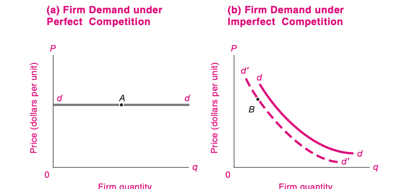
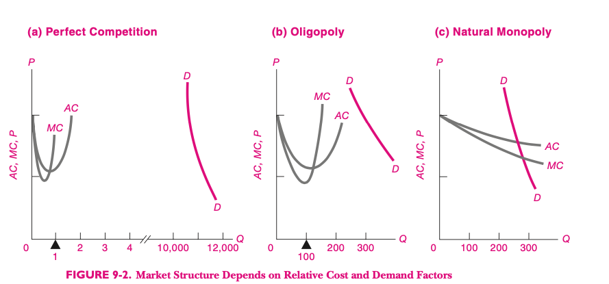
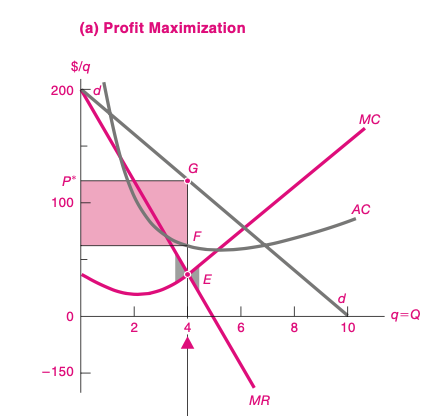

<style>

.center2 {
  margin: 0;
  position: absolute;
  top: 50%;
  left: 50%;
  -ms-transform: translate(-50%, -50%);
  transform: translate(-50%, -50%);
}

</style>

```{r setup, include=FALSE}
options(htmltools.dir.version = FALSE)
knitr::opts_chunk$set(echo = TRUE, echo = FALSE, warning = FALSE)
library(ggplot2)
library(kableExtra)
library(dplyr)

options(knitr.kable.NA = '')


theme_set(
  theme_classic() + 
    theme(
      plot.title = element_text(hjust = 0.5)
    ))


```

# Competencia Imperfecta

- Bajo competencia imperfecta, las empresas producen menos a precios mayores, lo que conlleva pérdidas de eficiencia.
- La mayor parte de los mercados operan bajo algún tipo de competencia imperfecta.
- Los competidores imperfectos pueden aprovechar economías de escala y pueden ser altamente innovadores (FAANG).

---
# Competencia Imperfecta

- Se da cuando uno o más vendedores individuales tiene algún control sobre el precio de su producción.



---
# Elasticidad de la demanda

- La demanda que enfrenta una empresa en competencia es perfectamente elástica.
- La demanda que enfrenta una empresa en competencia imperfecta es inelástica.

---
# Tipos de competencia imperfecta: Monopolio 
- Un solo vendedor.
- Se deben a __regulaciones__ o a __patentes__

---
# Tipos de competencia imperfecta: Oligopolio
- Pocos vendedores.
- Cada empresa puede influir en el precio del mercado.

---
# Tipos de competencia imperfecta: Competencia monopolística
- Hay diferenciación de productos.
- El mercado tiene múltiples nichos que le dan cierta libertad de acción a los productores.


---

# Fuentes de imperfecciones de mercado

- Costos y demanda
- Barreras a la entrada de competidores

---

# Costos y Competencia Imperfecta

- Si la demanda es grande respecto al Costo Medio Mínimo de una empresa típica va a haber muchas empresas.
- Si la demanda es chica respecto al Costo Medio Mínimo de una empresa típica, va a haber pocas empresas.



---
# Barreras a la entrada

- Restricciones legales.
- Economías de escala, costos altos de inversión inicial.
- Publicidad


---
# Monopolio: Ingreso Marginal

- Si hay un solo productor, ¿qué precio debe cobrar?
- ¿Qué cantidad debe producir?
- El Ingreso Marginal es un concepto clave para responder estas preguntas.

---
# Ingreso marginal y precio

- Siempre se cumple que $I. Mg. < P$.
- ¿Por qué?


---
# Ejemplo numérico

```{r}
tabla_completa <- tibble::tibble(q = 0:10,
       P = seq(200, 0, by=-20),
       `Ingreso Total` = P * q,
       `Ingreso Marginal` = `Ingreso Total`-dplyr::lag(`Ingreso Total`))

tabla <- tabla_completa %>% 
  mutate(
    P = if_else(P==20, NA_real_, P),
    `Ingreso Total` = if_else(`Ingreso Total`==420, NA_real_, `Ingreso Total`),
    `Ingreso Marginal` = if_else(`Ingreso Marginal`==-20, NA_real_, `Ingreso Marginal`)
  )

tabla %>% 
  knitr::kable() %>% 
  kable_styling()
```

---
# Gráficamente



---
# Ingresos, beneficios y costos


