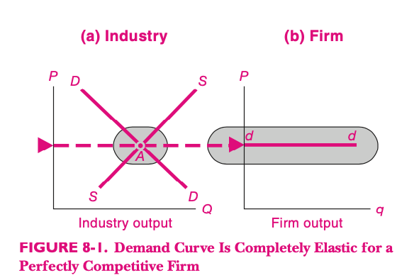
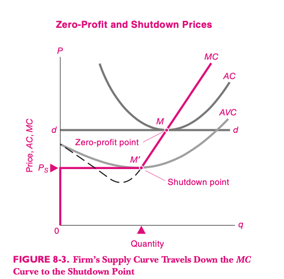
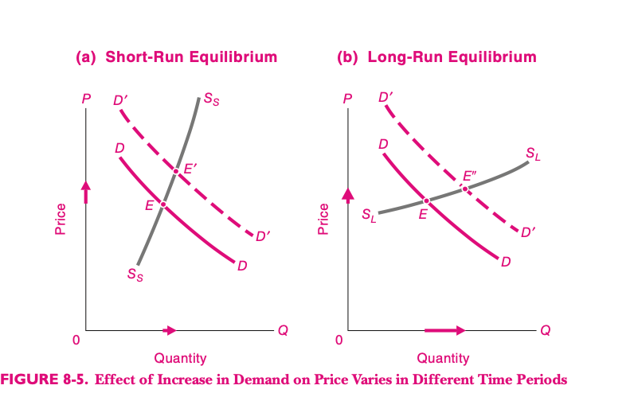
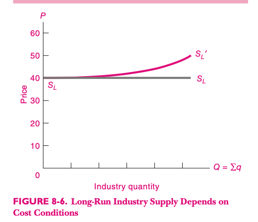
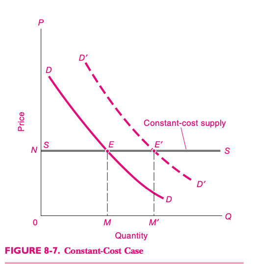
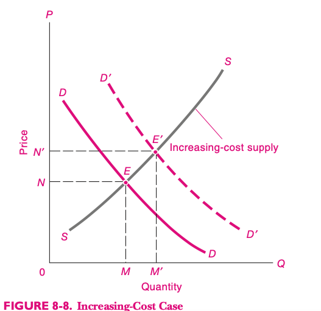
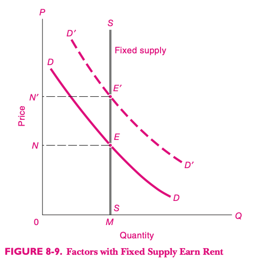
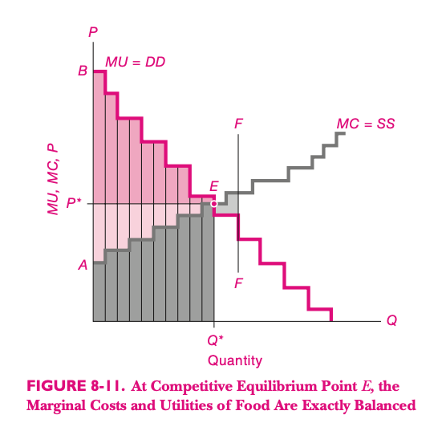

<style>

.center2 {
  margin: 0;
  position: absolute;
  top: 50%;
  left: 50%;
  -ms-transform: translate(-50%, -50%);
  transform: translate(-50%, -50%);
}

</style>

```{r setup, include=FALSE}
options(htmltools.dir.version = FALSE)
knitr::opts_chunk$set(echo = TRUE, echo = FALSE, warning = FALSE)

library(kableExtra)
library(tibble)
library(emo)
library(dplyr)
library(ggplot2)
theme_set(
  theme_classic() + 
    theme(
      plot.title = element_text(hjust = 0.5)
    ))


```


# Estructuras de Mercado y Organización Industrial


- Analizamos la oferta y la demanda.
- Oferta y demanda pueden interactuar de distintas formas dando lugar a distintas estructuras de mercado, según los oferentes y demandantes tengan mayor o menor __poder de mercado__.


---

# Tipología

- Hay muchos oferentes y demandantes y ninguno tiene poder de mercado: competencia perfecta.
- Un solo oferente concentra toda la oferta: monopolio.
- Varios casos intermedios, vamos a hablar de oligopolio y competencia monopolística.

---
# Competencia Perfecta

Analizamos estos mercados y el comportamiento de las empresas en base a dos supuestos:

- Los actores están _atomizados_ y no concentran poder.
- Maximizan beneficios.

---
# Demanda de mercado y demanda individal

La curva de demanda que enfrentan los productores en compentencia perfecta es horizontal.



---
# Maximización de beneficios

¿Qué desean los empresarios? 
- ¿Vender lo más posible? `r emo::ji("x")`
- ¿Gastar lo menos posible? `r emo::ji("x")`
- Ganar las mayores ganancias posibles. `r emo::ji("white_check_mark")`


---
# Tabla

- Relación entre Precio, Costo Medio y Beneficios.
- Relación entre Precio, Costo Marginal y Beneficios Marginales.
- Máximo beneficio.
---

# Ejemplo Numérico

```{r}


datos <- tibble(
  q = c(0, 1000, 2000, 3000, 3999, 4000, 4001, 5000),
  CT = c(55000, 85000, 110000, 130000, 159960, 160000, 160040, 210000),
  CMg = c(NA, 27, 22, 21, 38.98, 40, 40.02, 60),
  Precio=40,
) %>% 
  mutate(
    Cme = CT/q,
    Ingresos = q*Precio,
    Beneficios=Ingresos-CT
  ) 

datos %>% 
  kable() %>%
  kable_styling()


```


---
# Oferta y Costo marginal


---
# Punto de cierre



- La empresa tendrá pérdidas si $P < C\ Medio$
- La empresa cerrará si $P < C\ Variable\ Medio $
---

# Corto Plazo y Largo Plazo




----
# Distintas ofertas de largo plazo




---

# Distintos tipos de oferta

.pull-left[

]

.pull-right[

]

---

# Distintos tipos de oferta (2)




---
# Eficiencia

¿Qué es?

---
# Mercados Competitivos y Eficiencia

- La demanda viene dada por la Utilidad Marginal
- La demanda viene dada por el Costo Marginal



---

# Equilibrio Competitivo

- En equilibrio, $$P=C Marg = U Marg $$
- Cualquier otro punto tiene menor excedente económico.
