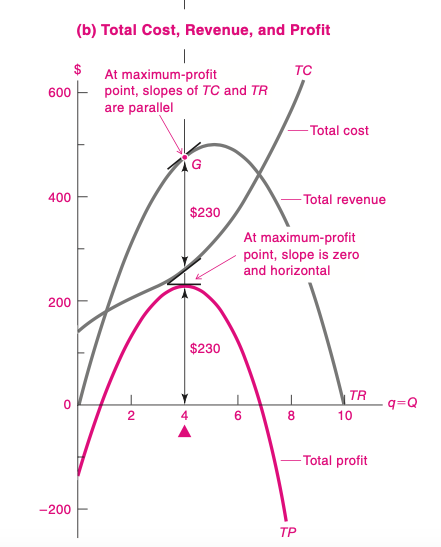
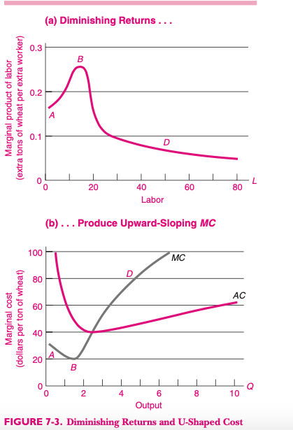

<style>

.center2 {
  margin: 0;
  position: absolute;
  top: 50%;
  left: 50%;
  -ms-transform: translate(-50%, -50%);
  transform: translate(-50%, -50%);
}

</style>

```{r setup, include=FALSE}
options(htmltools.dir.version = FALSE)
knitr::opts_chunk$set(echo = TRUE, echo = FALSE, warning = FALSE)
library(ggplot2)
library(dplyr)
library(cowplot)
library(kableExtra)


```


# Costos

- Las empresas incurren en costos para producir.
- Sus decisiones dependen de las curvas de costos que enfrentan, porque los costos impactan en los beneficios.
- Analizamos varias curvas de costos y el __costo de oportunidad__.

---
# Costo Fijo y Variable

- Son funciones de la cantidad producida $q$.
- Los costos fijos no dependen de la cantidad producida.
- Los variables si.
- Graficarlos


---
# Ejemplo

| q  |CF   |CV   |CT   |
|---|---|---|----|-----|
|  0 |55   |0     | 55  |
| 1  |55   |30    | 85  |
| 2  |55   |55    | 110  |
| 3  |55   |75    | 130  |
| 4  |55   |105   | 160  |
| 5  |55   |155   | 210  |
| 6  |55   |225   | 280  |


---
# Costo Marginal

- Es el costo de producir una unidad extra.
- Ejemplo de costo marginal bajo:
  - Software
  - Aerolíneas
- Ejemplo de costo marginal alto
  - Electricidad con alta demanda.
---
# Ejemplo numérico

| q  |  CT |MC   |
|----|---|---|
| 0  |55   |   |
| 1  |85   |30   |
| 2  |110   | 25  |
| 3  |130   | 20  |
| 4  |160   | 30  |
| 5  |210   | 50  |  
---
# Costo Medio

Es el costo promedio por unidad:

$$CMe = \frac{CT}{q}$$
---
# Costo Fijo Medio, Costo Variable Medio

- $CFMe=\frac{CF}{q}$

- El Costo Fijo medio cae porque cuanto más produzco, divido ese costo fijo entre más unidades.


- $CVMe=\frac{CV}{q}$

- La forma de la curva de Costo variable depende de la productividad de los factores variables.


---
# Costos Medios, Fijos y Marginales



---

# Explicación del gráfico

- El Costo Fijo Medio decrece cuando aumentamos la cantidad producida.
- Los Costos Medios y Marginales tienen forma de U por la productividad marginal (creciente al principio y decreciente después).
- Si el costo marginal es menor que el costo medio, la última unidad fue más __barata__ que el promedio. Eso hace que el costo medio __baje__.
- Si el costo marginal es mayor que el costo medio, la última unidad fue más __cara__ que el promedio. Eso hace que el costo medio __suba__.
- Si el costo marginal es igual al costo medio, el costo medio está en un extremo, ni sube ni baja.


---
# Costos Fijos Medios, Costos Variables Medios y Costos Marginales Medios.

| q |CF   |CV    |CT   |
|---|-----|-----|------|
| 0 |55   |0    | 55   |
| 1 |55   |30   | 85   |
| 2 |55   |55   | 110  |
| 3 |55   |75   | 130  |
| 4 |55   |105  | 160  |
| 5 |55   |155  | 210  |
| 6 |55   |225  | 280  |
---

# Costos y Productividad (Marginales)

.pull-left[

- La forma de la curva de costos depende de la productividad marginal.
- Si hay un factor fijo (capital), al __principio__ la productividad marginal crece a medida que aumentamos el factor variable (trabajo).
- Eso implica que le costo marginal baja.
- Luego de que llegamos a cierto nivel, el factor fijo se satura, y la productivdad marginal empieza a caer.
- Esto hace que los costos marginales suban.

]

.pull-right[


]
