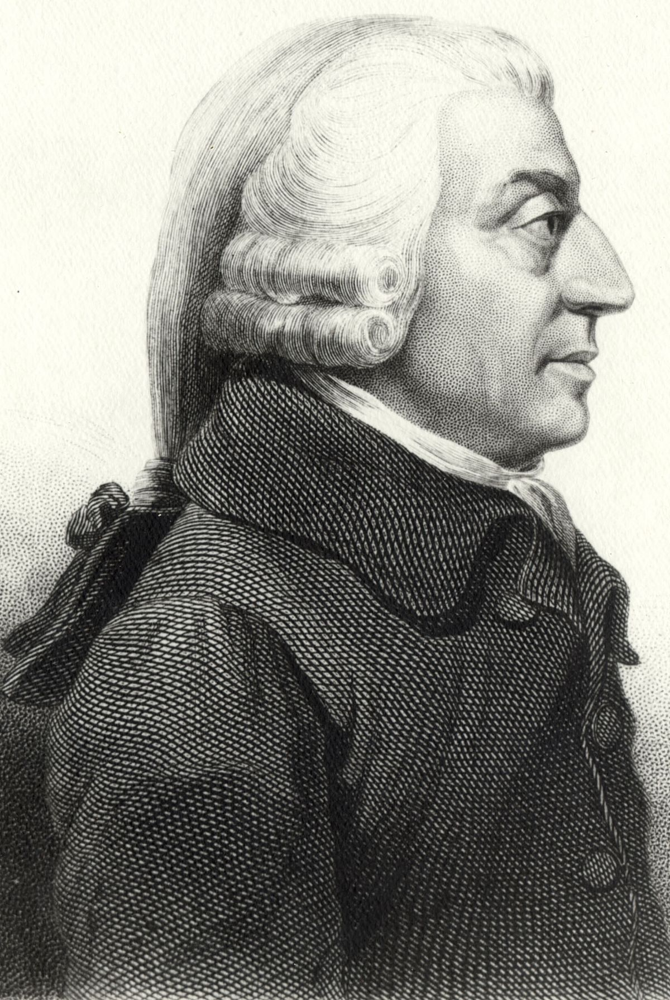
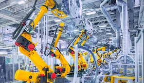
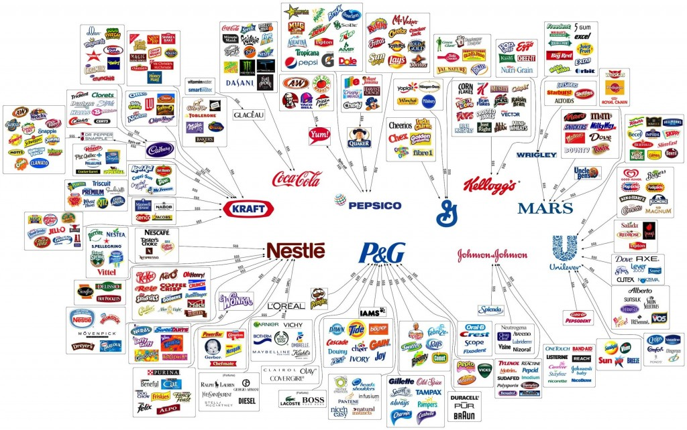
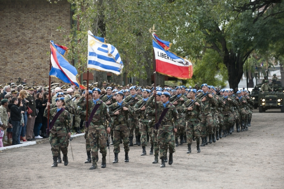
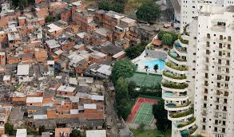
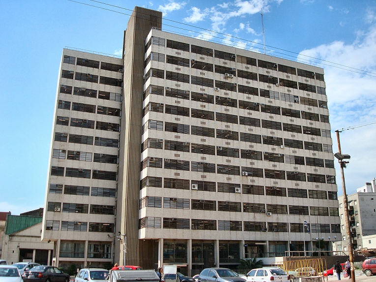

<style>

li {
  margin-bottom: 20px;

}

.remark-slide-content {

  height: 200px;
}
</style>

```{r setup, include=FALSE}
options(htmltools.dir.version = FALSE)
knitr::opts_chunk$set(echo = TRUE, echo = FALSE, warning = FALSE)
library(ggplot2)
library(tidyverse)
library(dplyr)
library(cowplot)
library(knitr)
library(kableExtra)

theme_set(
  theme_classic() + 
    theme(
      plot.title = element_text(hjust = 0.5)
    ))


```


# ¿Por qué estudiar economía?

Algunas preguntas que busca responder la economía:

- ¿Por qué algunos países son más ricos que otros?
- ¿Cómo se determina el salario de los trabajadores?
- ¿Qué medidas debe tomar el gobierno para mejorar el bienestar de la población?
- ¿Qué efectos tiene el comercio con otros países?

---

# Conceptos Clave

- Economía normativa y economía positiva.
- Macroeconomía y microeconomía.
- Escasez y eficiencia.

---

# Eficiencia

```{r}
library(ggrepel)
library(cowplot)
theme_set(theme_minimal(base_size = 22) + 
            theme(plot.title = element_text(hjust = 0.5)))
```

- Una economía es __eficiente__ cuando produce la máxima cantidad dados los recursos que tiene.
- Los recursos de una economía son los __factores de producción__ o __inputs__:
  - Trabajo
  - Capital
  - Recursos Naturales


---
# Frontera de Posiblidadades de Producción

.pull-left[
- 2 bienes.
- ¿Cuánto producimos de cada uno?
- Opciones dependen de factores disponibles y tecnología.
]

.pull-right[
```{r}
# Table 1.1
table_1 <- tibble(manteca = 0:5,
                  armas = c(15, 14, 12, 9, 5, 0),
                  labs = LETTERS[1:6])
fig_1 <- ggplot(table_1, aes(manteca, armas)) + 
  geom_point() + 
  geom_segment(aes(x = 0, y = 0, xend = 0, yend = 18), arrow = arrow(length=unit(0.2, "cm"))) +
  geom_segment(aes(x=0, y=0, xend = 6, yend = 0), arrow = arrow(length=unit(0.2, "cm"))) + 
  scale_x_continuous(breaks = c(0:5),
                     labels = c(0:5)) +
  geom_text_repel(aes(label=labs)) + 
  labs(x= "Manteca\n(Millones de kilos)", y="Armas (Miles)")
fig_1
```
]

---
# FPP

```{r warning=FALSE, fig.width=10}
library(patchwork)

highlight_A <- fig_1 + 
  geom_point(data = filter(table_1, labs == "A"), alpha = 1, color = "red", size = 5, shape = 21) + 
  labs(title = "Solo Armas")

highlight_B <- fig_1 + 
  geom_point(data = filter(table_1, labs == "F"), alpha = 1, color = "red", size = 5, shape = 21) + 
  labs(title = "Solo Manteca")

highlight_A + highlight_B
```

---

# FPP

.pull-left[
- Si estamos adentro de la FPP somos ineficientes.
- Nunca podemos estar afuera.

]

.pull-right[
```{r}
fig_2_data <- bind_rows(table_1,
  tibble(manteca = c(4, 2),
                       armas = c(9, 6),
                       labs = c("I", "U")))

plot <- ggplot(fig_2_data, aes(manteca, armas)) + 
  geom_segment(aes(x = 0, y = 0, xend = 0, yend = 18), arrow = arrow(length=unit(0.2, "cm"))) +
  geom_segment(aes(x=0, y=0, xend = 6, yend = 0), arrow = arrow(length=unit(0.2, "cm"))) +
  geom_line(data = table_1) + 
  geom_area(data = table_1, alpha = 0.3) + 
  geom_point() + 
  geom_text_repel(aes(label=labs)) + 
  labs(x= "Manteca\n(Millones de kilos)", y="Armas (Miles)")

plot
```
]


---
# Avances tecnológicos

.pull-left[
- Desplazamientos cuando la tecnología nos hace más productivos

]

.pull-right[
```{r}
df <- tribble(
  ~food, ~machines,   ~lab,
  0,      150,        "A",  
  10,     140,        "B",
  20,     120,        "C",
  30,     90,         "D",
  40,     50,         "E",
  50,     0,          "F"
) %>% 
    mutate(machines_2 = machines + 30) %>% 
  bind_rows(c(machines=0, machines_2=0, food = 55 ))
# Figure 3 - Crecimiento Economico
ggplot(df, aes(x=food, y=machines)) + 
  geom_point() + 
  geom_line() + 
  geom_line(aes(x=food, y = machines_2), lty="dashed") + 
  geom_ribbon(aes(ymin = 0, ymax=machines), alpha = 0.5) + 
  geom_ribbon(aes(ymin = machines, ymax = machines_2), alpha = 0.5, fill = "red") +
  geom_line(aes(x=food, y=machines)) + 
  geom_segment(aes(x = 0, y = 0, xend = 0, yend = 200), arrow = arrow(length=unit(0.2, "cm"))) +
  geom_segment(aes(x=0, y=0, xend = 60, yend = 0), arrow = arrow(length=unit(0.2, "cm"))) +
  labs(x="Comida", y= "Máquinas")
```

]


---
# Aplicaciones

Podemos aplicar la FPP para analizar decisiones entre dos alternativas.
  - Consumo civil vs. consumo militar (EUA)
  - Producción agrícola vs. industrias (China)
  - Alimentos y manufacturas
  - Consumo e inversión

---
# Los principales problemas que enfrenta la economía

- ¿Qué producir?
Las economías tienen __estructuras productivas__ diferentes.

- ¿Cómo producir?
Las economías usan tecnologías diferentes para producir bienes y servicios.

- ¿Para quién producir?
Las economías distribuyen lo que producen de formas diferentes.


---

# Economías Mixtas

- Las economías modernas don __economías **mixtas**__ 
- Responden estas preguntas con una combinación de dos mecanismos:
  - El mercado
  - El estado

---

# El mercado

- Es donde se encuentran los compradores (demanda) y vendedores (oferta).
- Coordina millones de agentes descentralizadamente.

- Determinan el precio de un bien y la cantidad vendida

  

---
# Mercado y Precios 

.pull-left[



]

.pull-right[

- Adam Smith fue el primero en entender el papel de los mercados en este proceso.
- Funcionan como señales para que los agentes económicos tomen decisiones.
- Estas decisiones determinan qué, cómo y para quién se produce.

]

---

# Tecnología y preferencias

- Son las grandes determinantes del comportamiento de los agentes.

---

# Comercio

- El comercio permite la división y la **especialización** de los factores productivos: la tierra, el trabajo y el capital.
- La globalización agrandan el tamaño del mercado y aumentan las posibilidades de división del trabajo de forma que un profesor de economía en Uruguay pueda acceder a bienes producidos en China por una empresa de EUA con mano de obra local.

---
# Capital

.pull-left[
- En las economías modernas el capital -maquinaria, edificios, etc- tiene un rol fundamental para aumentar la productividad de los trabajadores.
]

.pull-right[
  

]


---
# Dinero

.pull-left[
- La importancia del dinero para facilitar el intercambio y la especialización. 
- Sin dinero deberíamos usar el trueque, y dependemos de que las personas que producen lo que necesitamos quieran lo que nostros producimos.

]

.pull-right[
  

]

---
# El rol del Estado

En **competencia perfecta**, el mercado asigna los recursos de manera eficiente. Sin embargo, en una economía mixta, el Estado tiene un rol clave para:

- Ineficiencias
- Resultados eficientes pero injustos
- Proveer estabilidad macroeconómica

---
# Competencia Imperfecta

Los oferentes o los demandantes tienen __poder de mercado__.


 
 
 
---
# Competencia Imperfecta (2)

.pull-left[
  
]

.pull-right[
  
]

---
# Externalidades

Es cuando la actividad económico genera efectos que no se reflejan en los precios.

.pull-left[
  Postivas
  
]

.pull-right[
  Negativas
  

]

---
#Bienes Públicos

No es posible excluir personas de su consumo

.pull-left[
    

]

---
# Desigualdad


-Algunos resultados pueden ser ineficientes pero injustos



---
# Estabilidad Macroeconómica

El nivel de actividad, el empleo y el nivel general de precios.

.pull-left[
  - Política Fiscal (en Uruguay depende del Ministerio de Economía)

  
]

.pull-right[
  - Política Monetaria (Bancos Centrales)
  
]


