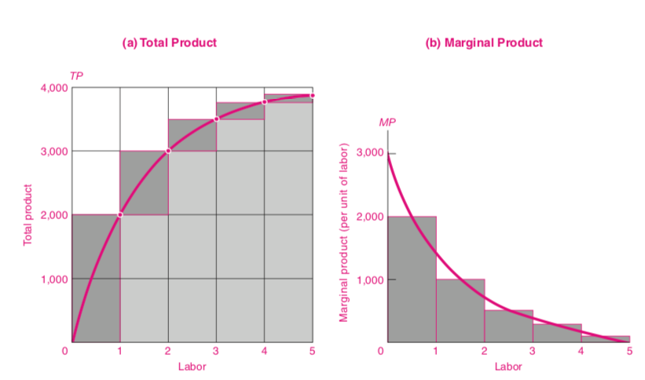
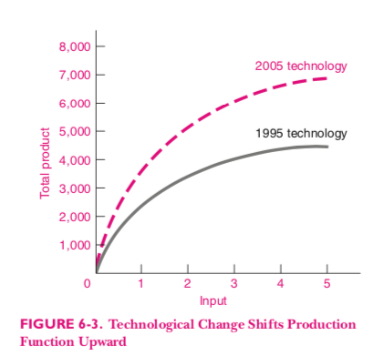
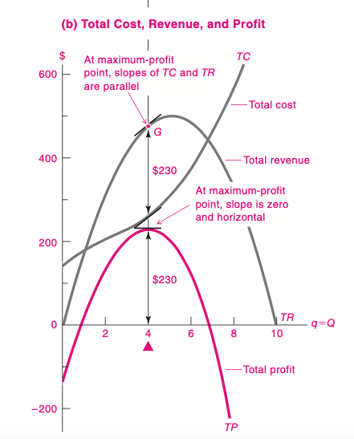
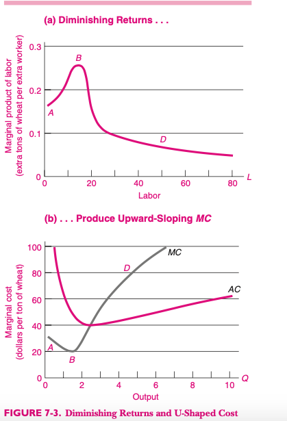

<style>

.center2 {
  margin: 0;
  position: absolute;
  top: 50%;
  left: 50%;
  -ms-transform: translate(-50%, -50%);
  transform: translate(-50%, -50%);
}

</style>

```{r setup, include=FALSE}
options(htmltools.dir.version = FALSE)
knitr::opts_chunk$set(echo = TRUE, echo = FALSE, warning = FALSE)
library(ggplot2)
library(dplyr)
library(cowplot)
library(kableExtra)

theme_set(
  theme_classic() + 
    theme(
      plot.title = element_text(hjust = 0.5)
    ))

```

# Las capacidades productivas de la sociedad

-Dependen de la fuerza laboral, el stock y calidad del capital (maquinaria, edificios, etc.), las capacidades tecnológicas y las instituciones.

- En esta unidad analizamos como interactúan la producción, los costos y la función de oferta.

---

# Las empresas

- Son las unidades productivas, que compran __inputs__ en un mercado y producen _outputs_.
- Cada sector de la economía tiene distintas estructuras.
- Los sectores de la economía se pueden ver a distintos niveles de agregación:
  - Agropecuario
  - Industrial
  - Servicios.

---

# 3 Conceptos Básicos
- __Producto Total__. Es la cantidad producida para determinado nivel de output
- __Producto Marginal__. Es la cantidad extra que produce la última unidad de input que uso.
- __Producto Medio__. Es la cantidad de output por unidad de producto.
---

# Ejemplo Numérico


| Input  |  Producto Total |Producto Marginal   |Producto Medio   |
|---|---|---|---|
|  0 |  0 | -  | -   |
| 1  |  2000 |2000   |  2000 |
| 2  |  3000 |1000   |1500   |
| 3  |  3500 |500   |1167   |
| 4  |  3800 |300   |950   |
| 5  |  3900 |100   |780   |


---
# La función de producción

Relaciona la cantidad de inputs con el output.

- $F(K, L) = Y$
- $F(L)  = Y$

¿Cuál es la diferencia entre las dos?

---
# Función de Producción




---
# Rendimientos Marginales Decrecientes

- En general, el producto marginal es decreciente.
- Intuición.

---
# Retornos a escala
- Los rendimientos marginales aplican cuando solo cambio uno de los inputs.
- ¿Qué pasa cuando cambio todos los inputs a la vez?
- Si duplico todos los inputs, ¿qué pasa con outputs?

---
# Retornos a escala
- Si $F(2*K, 2*L) = 2*Y$ tengo rendimientos constantes a escala.
- Si $F(2*K, 2*L) > 2*Y$ tengo rendimientos crecientes a escala.
- Si $F(2*K, 2*L) < 2*Y$ tengo rendimientos decrecientes a escala.

---
# Plazos cortos y largos.

- En el corto plazo solo se ajustan factores __variables__
- En el largo plazo se ajustan __todos los factores productivos__
---
# Cambio tecnológico

- El crecimiento económico de largo plazo depende de la mejora tecnológica
- ¿Qué pasa con las tecnologías obsoletas?

---
# Función de Producción y Cambio Tecnológico


---
# Medición de la productividad


- Producto por trabajador
- Productividad multifactorial

[Ver este artículo de La Diaria](https://ladiaria.com.uy/articulo/2010/5/salarios-productividad-y-poder/)


---
# Costos

- Las empresas incurren en costos para producir.
- Sus decisiones dependen de las curvas de costos que enfrentan, porque los costos impactan en los beneficios.
- Analizamos varias curvas de costos y el __costo de oportunidad__.

---
# Costo Fijo y Variable

- Son funciones de la cantidad producida $q$.
- Los costos fijos no dependen de la cantidad producida.
- Los variables si.
- Graficarlos


---
# Ejemplo

| q  |CF   |CV   |CT   |
|---|---|---|----|-----|
|  0 |55   |0     | 55  |
| 1  |55   |30    | 85  |
| 2  |55   |55    | 110  |
| 3  |55   |75    | 130  |
| 4  |55   |105   | 160  |
| 5  |55   |155   | 210  |
| 6  |55   |225   | 280  |


---
# Costo Marginal

- Es el costo de producir una unidad extra.
- Ejemplo de costo marginal bajo:
  - Software
  - Aerolíneas
- Ejemplo de costo marginal alto
  - Electricidad con alta demanda.
---
# Ejemplo numérico

| q  |  CT |MC   |
|----|---|---|
| 0  |55   |   |
| 1  |85   |30   |
| 2  |110   | 25  |
| 3  |130   | 20  |
| 4  |160   | 30  |
| 5  |210   | 50  |  
---
# Costo Medio

Es el costo promedio por unidad:

$$CMe = \frac{CT}{q}$$
---
# Costo Fijo Medio, Costo Variable Medio

- $CFMe=\frac{CF}{q}$

- El Costo Fijo medio cae porque cuanto más produzco, divido ese costo fijo entre más unidades.


- $CVMe=\frac{CV}{q}$

- La forma de la curva de Costo variable depende de la productividad de los factores variables.


---
# Costos Medios, Fijos y Marginales



- Si el costo marginal es menor que el costo medio, la última unidad fue más __barata__ que el promedio. Eso hace que el costo medio __baje__.
- Si el costo marginal es mayor que el costo medio, la última unidad fue más __cara__ que el promedio. Eso hace que el costo medio __suba__.
- Si el costo marginal es igual al costo medio, el costo medio está en un extremo, ni sube ni baja.


---
# Costos Fijos Medios, Costos Variables Medios y Costos Marginales Medios.

| q |CF   |CV    |CT   |
|---|-----|-----|------|
| 0 |55   |0    | 55   |
| 1 |55   |30   | 85   |
| 2 |55   |55   | 110  |
| 3 |55   |75   | 130  |
| 4 |55   |105  | 160  |
| 5 |55   |155  | 210  |
| 6 |55   |225  | 280  |
---

.left[
- La forma de la curva de costos depende de la productividad marginal.
- Si hay un factor fijo (capital), al __principio__ la productividad marginal crece a medida que aumentamos el factor variable (trabajo).
- Eso implica que le costo marginal baja.
- Luego de que llegamos a cierto nivel, el factor fijo se satura, y la productivdad marginal empieza a caer.
- Esto hace que los costos marginales suban.
]

.right[


]

---
# Función de Producción y Costos

Los costos, los precios de los factores y la cantidad de inputs están vinculados:

| Producción |Tierra   |Trabajadores    |Renta |Salario |Costo Total|
|------------|--------|---------|----------------|------|--------|-----------|---------|
| 0 |10      |0        | 5.5    |5 |
| 1 |10      |6         | 5.5   |5| 
| 2 |10      |11         | 5.5  |5 | 
| 3 |10      |15         | 5.5  |5 |
| 4 |10      |21        | 5.5  |5 |
| 5 |10      |31        | 5.5  |5 |
| 6 |10      |45        | 5.5  |5 |

- Calcular el Costo Total.
