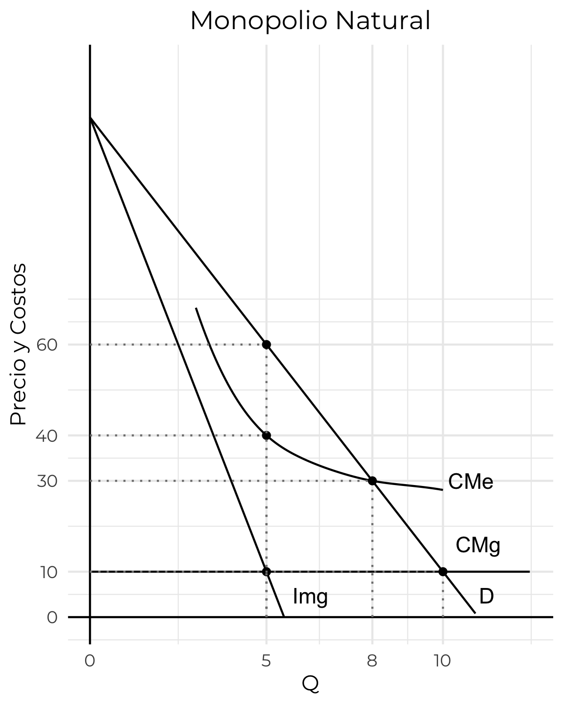
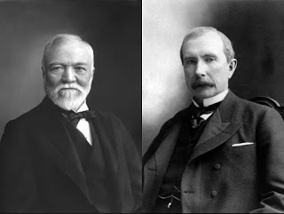
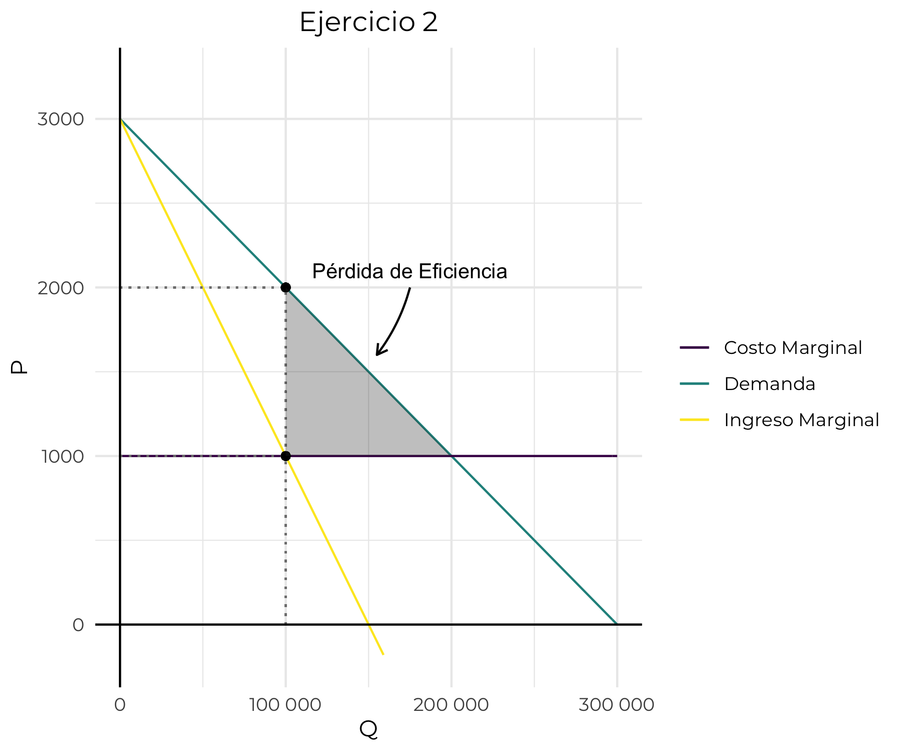

<style>

.center2 {
  margin: 0;
  position: absolute;
  top: 50%;
  left: 50%;
  -ms-transform: translate(-50%, -50%);
  transform: translate(-50%, -50%);
}

.remark-slide-content {

 height: 200px;
}

li {
  margin-bottom: 20px;
}


</style>

```{r setup, include=FALSE}
options(htmltools.dir.version = FALSE)
knitr::opts_chunk$set(echo = TRUE, echo = FALSE, warning = FALSE)
library(ggplot2)
library(kableExtra)
library(dplyr)

options(knitr.kable.NA = '')


theme_set(
  theme_classic() + 
    theme(
      plot.title = element_text(hjust = 0.5)
    ))


```

# Competencia Imperfecta

- Bajo competencia imperfecta, las empresas producen menos a precios mayores, lo que conlleva pérdidas de eficiencia.
- La mayor parte de los mercados operan bajo algún tipo de competencia imperfecta.
- Los competidores imperfectos pueden aprovechar economías de escala y pueden ser altamente innovadores (FAANG).

---
# Competencia Imperfecta

- Se da cuando uno o más vendedores individuales tiene algún control sobre el precio de su producción.


---
# Elasticidad de la demanda


- La demanda que enfrenta una empresa en competencia es perfectamente elástica.
- La demanda que enfrenta una empresa en competencia imperfecta es inelástica.

---
# Tipos de competencia imperfecta

### Monopolio 
- Un solo vendedor.
- Se deben a __regulaciones__ o a __patentes__

---
# Tipos de competencia imperfecta
### Oligopolio
- Pocos vendedores.
- Cada empresa puede influir en el precio del mercado.

---
# Tipos de competencia imperfecta
### Competencia monopolística
- Muchos vendedores, pero los productos son diferenciados.
- El mercado tiene múltiples nichos que le dan cierta libertad de acción a los productores.


---

# Fuentes de imperfecciones de mercado

- Costos y demanda
- Barreras a la entrada de competidores

---

# Costos y Competencia Imperfecta

- Si la demanda es grande respecto al Costo Medio Mínimo de una empresa típica va a haber muchas empresas.
- Si la demanda es chica respecto al Costo Medio Mínimo de una empresa típica, va a haber pocas empresas.


---
# Barreras a la entrada

- Restricciones legales.
- Economías de escala, costos altos de inversión inicial.
- Publicidad


---
# Monopolio: Ingreso Marginal

- Si hay un solo productor, ¿qué precio debe cobrar?
- ¿Qué cantidad debe producir?
- El Ingreso Marginal es un concepto clave para responder estas preguntas.

---
# Ingreso marginal y precio

- Siempre se cumple que el Ingreso marginal es menor al precio.
- ¿Por qué?


---
# Ejemplo numérico

```{r}
tabla_completa <- tibble::tibble(q = 0:10,
       P = seq(200, 0, by=-20),
       `Ingreso Total` = P * q,
       `Ingreso Marginal` = `Ingreso Total`-dplyr::lag(`Ingreso Total`))

tabla <- tabla_completa %>% 
  mutate(
    P = if_else(P==20, NA_real_, P),
    `Ingreso Total` = if_else(`Ingreso Total`==420, NA_real_, `Ingreso Total`),
    `Ingreso Marginal` = if_else(`Ingreso Marginal`==-20, NA_real_, `Ingreso Marginal`)
  )

tabla %>% 
  knitr::kable() %>% 
  kable_styling()
```


---
# Ejemplo numérico (2)


```{r}
tabla_completa %>% 
  knitr::kable() %>% 
  kable_styling()
```


---

# Elasticidad e ingreso marginal

- Si la demanda es lineal, cuando las ventas son muy bajas $E_d = \frac{ \Delta Q\%}{\Delta P \%}$, es muy alto porque $\Delta Q\%$ es muy alto (tiende a infinto)
- A medida que aumento las vantas, la elasticidad baja.
- Cuando el precio es muy bajo, se da el efecto inverso, ${\Delta P \%}$ tiende a infinito y la elasticidad es muy baja.
- En algún punto intermedio, la elasticidad es unitaria, y el ingreso marginal es 0.
- El máximo beneficio del monopolista se da a una cantidad vendida __menor__.

---
# Gráficamente


---
# Ingresos, beneficios y costos


---
# Regulación

.pull-left[
  
]

.pull-right[

- Sectores con altos costos fijos (infraestructura)
- Costos medios decrecientes
- Es más eficiente cubrir la demanda con una sola empresa.
]

---

# Regulación de Precios

- Si el regulador fija un precio igual al costo marginal la empresa tiene pérdidas.
- Si el regulador fija un precio máximo de $30, la cantidad es 8 y el costo medio es $30, la empresa no tiene pérdidas.

---

# Grandes Monopolios de la historia
.center[

- Los __robber barons__ de la _Gilded Age_ en EUA crearon grandes fortunas en base al crecimiento de la economía a fines del S. XIX.
- Actuaban de forma inescrupulosa para eliminar a la competencia y consolidarse como monopolistas en las industrias más importantes de la época: ferrocarriles, petróleo.
- En 1910 la Standard Oil, propiedad de Rockefeller se desmembró gracias la las leyes antimonopolio impulasadas por los gobiernos progresistas.
]


---
class: inverse, center, middle

# Ejercicios
---




