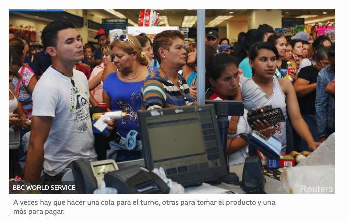
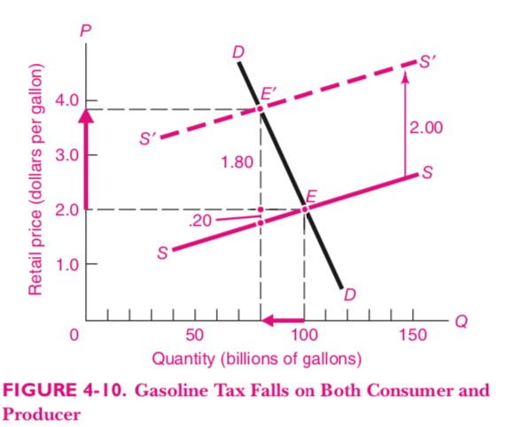

<style>

.center2 {
  margin: 0;
  position: absolute;
  top: 50%;
  left: 50%;
  -ms-transform: translate(-50%, -50%);
  transform: translate(-50%, -50%);
}

.remark-slide-content {

 height: 200px;
}

li {
  margin-bottom: 20px;
}

</style>

```{r setup, include=FALSE}
options(htmltools.dir.version = FALSE)
knitr::opts_chunk$set(echo = TRUE, echo = FALSE, warning = FALSE)
library(ggplot2)
library(dplyr)
library(kableExtra)

theme_set(
  theme_classic(base_size= 22) + 
    theme(
      plot.title = element_text(hjust = 0.5)
    ))

demand <- Hmisc::bezier(c(1, 3, 9),
                        c(9, 3, 1)) %>%
  as_data_frame()
```

# La Demanda


---

# 쯈ué es la demanda?
La demanda de un bien es la cantidad que alguien está dispuesto a comprar de ese bien __a determinado precio__.

Es la __relación__ entre la cantidad demandada y el precio del bien.

---
# Varias formas de visualizarlo

.pull-left[
Como una tabla

Precio | Cantidad demandada  
-------| ------------------- 
10     | 0                   
8      | 10                  
6      | 20                  
4      | 30                  
2      | 40                  
0      | 125
]
                 


.pull-right[
Como una función


$$ Q_d = Q(p_d) $$
]


---
class: center
# Gráficamente

```{r}
# Nordhaus pg. 46
library(ggrepel)

df <- tribble(
  ~precio, ~cantidad, ~lab, ~momento,
  5,     9,           "A",  "Después",
  4,     10,          "B",  "Después",
  3,     12,          "B",  "Después",
  2,     15,          "D",  "Después",
  1,     20,          "E",  "Después"
)

ggplot(df, aes(x=cantidad, y=precio, color = momento)) + 
  geom_line(size = 1) + 
  geom_point(size= 4) +
  #geom_text_repel(aes(label=lab), show.legend=FALSE, size = 8) + 
  xlim(5, 20) + 
  ylim(0, 5) + 
  labs(x="Cantidad de Maíz",
       y="Precio del Maíz",
       title = "Demanda de Maíz"
       ) +
  theme(legend.position = "none",
    plot.title = element_text(hjust = 0.5),
    plot.subtitle = element_text(hjust = 0.5)
)

```

---

# La cantidad demandada no es la demanda

- La _demanda_ es la _cantidad demandada_ __para cada precio__.
- Un cambio en la demanda no es lo mismo que un cambio en la cantidad demandada.
- Si cambia el precio, cambia la cantidad demandada ( $Q_d$ ), pero no la demanda.
- Si cambia otro factor que afecta la demanda, cambia la demanda.


---

# Variables endógenas y variables exógenas

- Las variables endógenas son los efectos.
- Las variables exógenas son las causas.
- En el modelo de demanda, las variables endógenas son
  - La cantidad
  - El precio
  
---
# Factores exógenos

- Las exógenas son los __factores que explican la demanda__
  - Ingreso de los consumidores
  - Tamaño del mercado
  - Disponibilidad y precio de bienes relacionados (sustitutos y complementarios)
  - Preferencias de los consumidores
  - Factores coyunturales

- Cambian la __relación__ entre $Q_d$ y $P$.

---
# Bienes sustitutos


- Si dos bienes son sustitutos, el aumento del precio de uno hace que aumente la demanda del otro.
- Si sube el precio del pescado, la demanda de carne aumenta, porque los consumidores demandan más carne para sustituir el pescado que consumían a precios menores.

---
# Bienes Complementarios

- Si dos bienes son complementarios, el aumento del precio de uno hace que disminuya la demanda del otro.
- Si aumentan los precios de las consolas de videojuegos, la demanda por los juegos disminuye.

---
# Cambios en la demanda

.pull-left[
- Si aumenta el ingreso de los consumidores la curva se desplaza hacia la derecha
]

.pull-right[
```{r, warning=FALSE}
df_2 <- bind_rows(
  df,
  mutate(df, 
         momento = "Antes",
         cantidad = cantidad-5)
)

ggplot(df_2, aes(x=cantidad, y=precio, color=momento)) + 
  geom_line(size = 2) + 
  geom_point() +
  xlim(0, 20) + 
  ylim(0, 5) + 
  annotate("segment", x = 6, xend = 9, y=4, yend=4, arrow = arrow(length = unit(0.2, "cm"))) + 
  annotate("segment", x = 11, xend = 14, y=2, yend=2, arrow = arrow(length = unit(0.2, "cm"))) + 
  labs(x="Cantidad de Maíz",
       y="Precio del Maíz",
       title = "Demanda de Maíz",
       subtitle = "") +
  scale_color_discrete(name = "")
```
]

---

# Oferta


---

# La curva de oferta

Cuando aumenta el precio del bien que venden, los empresarios quieren producir más de ese bien. Eso implica que la curva de oferta de un bien tiene **pendiente positiva** en el plano $(Q, P)$

---

```{r}
df_3 <- mutate(df, 
         cantidad_ofrecida = c(18, 16, 12, 7, 0))

ggplot(df_3, aes(x=cantidad_ofrecida, y=precio, color = momento)) + 
  geom_line() + 
  geom_point() +
  labs(x="Cantidad de Maíz",
       y="Precio del Maíz",
       title = "Oferta de Maíz",
       subtitle = "Si el precio aumenta \nlos productores producen más") +
  theme(legend.position = "none")
```

---

# Factores que desplazan la curva de oferta

- Precios de los inputs
- Tecnología
- Precios de bienes relacionados (ejemplo soja-maíz)
- Políticas del gobierno
- Factores coyunturales de cada mercado

---

# Equilibrio de mercado

- Se da cuando los vendedores y compradores están en __equilibrio__.
- Si nadie tiene incentivos a cambiar sus decisiones, la situación es estable, y estamos en equilibrio.
- Si al precio de mercado vigente, los demandantes compran la cantidad que los productores están dispuestos a ofrecer, el mercado está en equilibrio.

---

# Gráficamente

```{r, message=FALSE}
theme_set(theme_minimal() + 
            theme(axis.text = element_text(size=8),
              plot.title = element_text(hjust = 0.5)))

library(reconPlots)
library(viridis)
x_max <- 5


line.1 <- data.frame(x = c(0, x_max),
                     y = c(0, x_max),
                     name="supply")

line.2 <- data.frame(x = c(x_max, 0),
                     y = c(0, x_max),
                     name="demand")

line.3 <- line.1 %>% 
  mutate(y = y + 2,
         name="demand_1")

line.intersection <- curve_intersect(line.1, line.2)

line.intersection.1 <- curve_intersect(line.3, line.2)


ggplot(mapping = aes(x=x, y=y)) + 
  geom_line(data = line.1, aes(color=name), size = 2) + 
  geom_line(data = line.2, aes(color=name), size = 2) + 
  geom_segment(lty = "dashed", 
               aes(x=0, y = line.intersection$y, xend=line.intersection$x, yend=line.intersection$y)) + 
  geom_segment(lty = "dashed", 
               aes(x=line.intersection$x, y=0, xend=line.intersection$x, yend=line.intersection$y)) +
  scale_color_manual(name = NULL, 
                     labels = c("Demanda", "Oferta"),
                     values = c("#23576E", "#099FDB", 
                                "#29B00E", "#208F84", 
                                "#F55840", "#924F3E")) +
  scale_x_continuous(expand = c(0, 0.2), breaks = c(0, line.intersection$x), labels=c("", expression(~Q[0])))  +
  scale_y_continuous(expand = c(0, 0.2), breaks = c(0, line.intersection$y), labels=c("", expression(~P[0]))) + 
  geom_segment(aes(x = 0, y = 0, xend = 0, yend = 6), arrow = arrow(length=unit(0.2, "cm"))) +
  geom_segment(aes(x=0, y=0, xend = 6, yend = 0), arrow = arrow(length=unit(0.2, "cm"))) + 
  theme(axis.title.y = 
          element_text(angle = 0),
        axis.title.x = 
          element_text(hjust=0.95, vjust=6))  +
  labs(x="Q", y="P")
```

---
## Estática Comparativa

Un aumento de la oferta provoca un aumento en la cantidad ofrecida y demandada y en una caída del precio.

```{r}
ggplot(mapping = aes(x=x, y=y)) + 
  geom_line(data = line.1, aes(group = 1, color=name), size=2) + 
  geom_line(data = line.2, aes(group = 1, color=name), size=2) + 
  geom_line(data = line.3, aes(group = 1, color=name), size=2) + 
  geom_segment(lty = "dashed", 
               aes(x=0, y = line.intersection$y, xend=line.intersection$x, yend=line.intersection$y)) + 
  geom_segment(lty = "dashed", 
               aes(x=line.intersection$x, y=0, xend=line.intersection$x, yend=line.intersection$y)) + 
  geom_segment(lty = "dashed",
               aes(x=line.intersection.1$x, y=0, xend=line.intersection.1$x, yend=line.intersection.1$y)) + 
  geom_segment(lty = "dashed",
               aes(x=0, y=line.intersection.1$y, xend=line.intersection.1$x, yend=line.intersection.1$y)) + 
  annotate("point", x=line.intersection$x, y=line.intersection$y) + 
  annotate("point", x=line.intersection.1$x, y = line.intersection.1$y) + 
  ylim(c(0, 7)) + 
  geom_segment(aes(x = 0, y = 0, xend = 0, yend = 7), arrow = arrow(length=unit(0.2, "cm"))) +
  geom_segment(aes(x=0, y=0, xend = 7, yend = 0), arrow = arrow(length=unit(0.2, "cm"))) + 
  scale_color_manual( name="", values = c("#23576E", "#099FDB", 
                                 "#29B00E", "#208F84", 
                                 "#F55840", "#924F3E"),
                      labels=c("Demanda",
                               "Oferta (t=0)",
                               "Oferta (t=1)")) +
  annotate("segment", x=3.5, y=4.85, xend=3.9, yend=4.5, arrow = arrow(length = unit(0.2, "cm"))) +
  labs(x="", y="")

```
---
# Precios mínimos

.pull-left[
- En el mercado de trabajo, el precio es el salario.
- El salario mínimo es un precio mínimo.
]


.pull-right[

]

---

# Precios mínimos (2)

- Si el gobierno fija un precio mínimo mayor que el precio de equilibrio, habrá un exceso de oferta en el mercado.
- Si el gobierno fija un precio mínimo menor que el precio de equilibrio, rige el precio de equilibrio.


---

# Precios máximos

- Si el gobierno fija un precio máximo menor que el precio de equilibrio, hay un exceso de demanda.

---
# Precios máximos en Argentina   🇦🇷


---
# Precios máximos en Venezuela 🇻🇪




---

# Precios máximos en Venezuela 🇻🇪


---
# Elasticidad Precio de la Demanda


- Ya sambemos que si el precio sube la cantidad demandada baja, la elasticidad precio de la demanda ( $E_p$ cuantifica esa caída.

- Mide __cuánto__ cambia la cantidad demandada cuando cambia el precio.

- Se calcula como el valor absoluto del cociente entre la variación porcentual en la cantidad y la variación porcentual en el precio:

$$ E_d = | \frac{ \Delta Q\%}{\Delta P \%} |$$
---
# Elasticidad Precio de la Demanda (2)


- La elasticidad de la demanda de un bien depende de varios factores:
  - Si el bien tiene muchos **sustitutos**, su demanda va a ser más elástica.
  - Si tomamos un **plazo de tiempo** largo, la demanda del bien es más elástica, porque los consumidores se ajustan mejor en el largo plazo.
  - Los **bienes de lujo** tienen demanda más elástica que los bienes de necesidad básica.

---
# Elasticidad Precio de la Demanda (3)


  - Si $E_p = 1$ el bien tiene **elasiticidad unitaria**. Eso implica que un cambio en 1% en el precio del bien implica un cambio de 1% en la cantidad demandada de ese bien.
  - Si $E_p > 1$ el bien tiene **demanda elástica**, un cambio de 1% en el precio del bien implica un cambio mayor a 1% en la cantidad demandada del bien.
  - Si $E_p < 1$ el bien tiene **demanda inelástica**, un cambio de 1% en el precio del bien implica un cambio menor a 1% en la cantidad demandada del bien.


---

# A tener en cuenta:

  - Usamos cambios porcentuales y no absolutos. Esto permite comparar elasticidades de distintos productos, y hace que los cálculos sean independientes de las unidades de medida. 
  - Para calcular la variación porcentual, usamos el promedio del valor inicial y el final como denominador. 
 
$$ \Delta P\%\ = \frac{\Delta P}{(P_0 + P_1) / 2}$$
Donde $\Delta P$ es la variación absoluta de $P$ ( $P_1 - P_0$ ), $P_0$ es el precio inicial y $P_1$ el precio final.

- Si no usamos valor absoluto, la elasticidad sería negativa.


---
# Ejemplo


---

# Ejemplo (1)

- El precio pasa de 90 a 110.
- La cantidad pasa de 240 a 160.

---

# Ejemplo (2)

- La variación absoluta del precio es 20.
- La variación absoluta de la cantidad es 80.

- La variación porcentual del precio es 20%. $(\frac{20}{\frac{90+110}{2}})$
- La variación porcentual de la cantidad es 40% $(\frac{80}{\frac{160+240}{2}})$.

---
# Casos extremos


---
# La elasticidad y los ingresos de las empresas

- Si hay un aumento en la oferta, baja el precio ( $P$ ) y sube la cantidad ( $Q$ ) .
- 쯈ué pasa con el ingreso de las empresas ( $P \times Q$ )?

- Depende de la elasticidad de la demanda.

---
# Elasticidad e ingresos (2)


---

# Elasticidad e ingresos

- Si la demanda es elástica, el aumento en $Q$ va a ser mayor que la caída en $P$, por lo que el ingreso total $P \times Q$ sube.
- Si la demanda es inelástica, el aumento en $Q$ va a ser menor que la caída en $P$ y el ingreso total $ P
\times Q $ cae.
- Si la elasticidad es unitaria, $Q$ cae en la misma proporción que $P$ sube. 


---
# Elasticidad Ingreso del combustible


---
# Elasticidad Ingreso de la demanda de combustibles

- El quintil más pobre de los hogares Uruguayos gasta 3,9% de sus ingresos en combustible.
- El quintil más rico gasta 4.9%.
- Cuando aumenta el ingreso, la participación de los combustibles en el prespuuesto total aumenta.
---

# Elasticidad Ingreso de la demanda de alimentos


---
# Elasticidad Ingreso de los Alimentos 

- A medida que los países se hacen más ricos, su gasto en alimentos aumenta, pero la participación de los alimentos en el gasto total decrece.

---
# Efecto de un impuesto

- Incidencia legal vs. incidencia económica
- A veces los productores pueden trasladar todo el peso del impuesto a los consumidores. 
- Depende de las elasticades relativas de oferta y demanda.

---
# Análisis económico




---
# Análisis económico (2)

- El equilibrio inicial es con un precio de $2 y 100 billones de galones vendidos.

- El impuesto hace que la oferta se desplace hacia la izquierda por $2.
- Esto se debe a que ahora los productores tienen que recibir $2 más por galón para producir la misma cantidad que antes.

- El nuevo equilibrio (E'), el precio es $3.8 y la cantidad 80 billones de galones. De esos $3.8, los productores reciben $1.8 y pagan $2 de impuestos, pero lograron trasladar la mayor parte de la suba a los consumidores.


