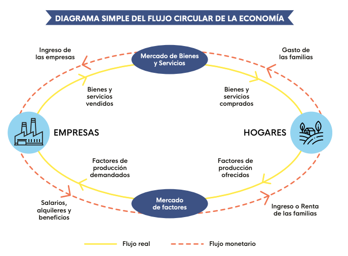

<style>

.center2 {
  margin: 0;
  position: absolute;
  top: 50%;
  left: 50%;
  -ms-transform: translate(-50%, -50%);
  transform: translate(-50%, -50%);
}

</style>

```{r setup, include=FALSE}
options(htmltools.dir.version = FALSE)
knitr::opts_chunk$set(echo = TRUE, echo = FALSE, warning = FALSE)

library(ggplot2)
library(tidyverse)
library(kableExtra)

options(knitr.kable.NA = '')


```


# Riqueza e ingresos

- El ingreso es un flujo monetario.
- La riqueza es un stock de activos que reportan un ingreso.

---
# Ingresos

- Los ingresos de un hogar provienen de su participación en el mercado de alguno de los factores de producción:



---

# Factores de producción

- Los hogares son los propietarios de los factores de producción (trabajo, capital, tierra)
- Estos factores de producción producen un ingreso cuando las empresas los usan para producir.

---

# El rol del estado

- El estado interviene en este proceso cobrando impuestos sobre algunos ingresos y canalizándolo a otros destinos a través de las transferencias y el gasto público.

- Los ingresos de los hogares se componen de los __ingresos de mercado__ más los __ingresos por transferencias__.

---
# El precio de los factores de producción

- Como todo mercado, el precio se determina por la interacción entre la oferta y la demanda de estos factores.

---

# Demanda de factores productivos

- Es una demanda derivada.
- La demanda de los distintos factores es interdependiente.

---
#  El ingreso marginal del trabajo

Es lo que le ingresa a la empresa por contratar un trabajador extra.

```{r}
tibble(
  trabajo = 0:5,
  `Producto Total` = c(0, 20e3, 30e3, 35e3, 38e3, 39e3),
  `Producto Marginal` = c(NA, 20e3, 10e3, 5e3, 3e3, 1e3),
  `Precio` = 3,
  `Ingreso Marginal del trabajo` = c(NA, 60e3, 30e3, 15e3, 9e3, 3e3)
) %>% 
  knitr::kable() %>% 
  kable_styling()
```

---
# Maximización de beneficios

- Si la empresa maximiza beneficios: 
$$Salario=Precio * Producto\ Marginal\ del\ Trabajo(L)$$

- Si sube el salario, la cantidad de trabajadores contratados (L) debe bajar, por el supuesto de rendimientos decrecientes.
- Esto implica que la demanda de trabajo tiene __pendiente negativa__.


---
# La oferta de trabajo

- Los trabajadores ofrecen su trabajo en el mercado.
- Suponemos que si les pagan más, querrán trabajar más, por lo que la curva de oferta tiene __pendiente positiva__.

---
# Equilibrio en el mercado de trabajo


---
# Diferencias en el mercado de trabajo


