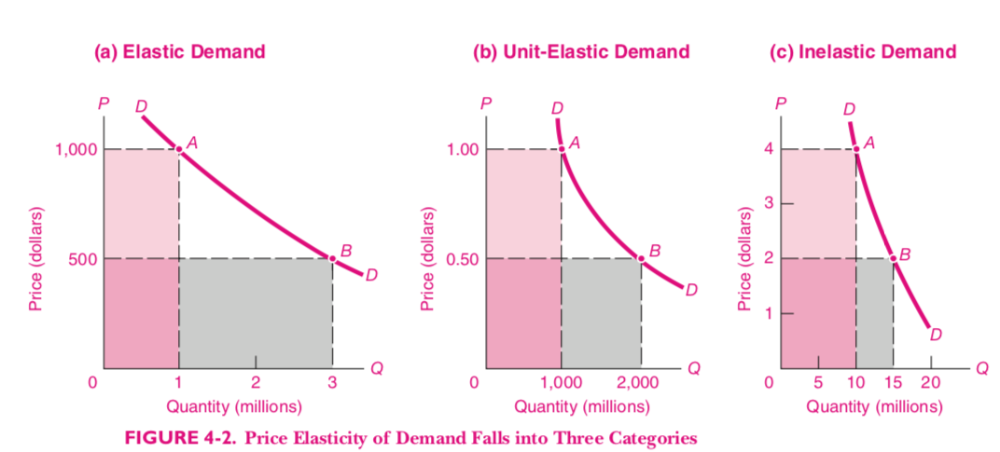

<style>

.center2 {
  margin: 0;
  position: absolute;
  top: 50%;
  left: 50%;
  -ms-transform: translate(-50%, -50%);
  transform: translate(-50%, -50%);
}

.remark-slide-content {

 height: 200px;
}

li {
  margin-bottom: 20px;
}

</style>

```{r setup, include=FALSE}
options(htmltools.dir.version = FALSE)
knitr::opts_chunk$set(echo = TRUE, echo = FALSE, warning = FALSE)
library(ggplot2)
library(dplyr)
library(kableExtra)

theme_set(
  theme_classic(base_size= 22) + 
    theme(
      plot.title = element_text(hjust = 0.5)
    ))

demand <- Hmisc::bezier(c(1, 3, 9),
                        c(9, 3, 1)) %>%
  as_data_frame()
```

# La Demanda


---

# ¿Qué es la demanda?
La demanda de un bien es la cantidad que alguien está dispuesto a comprar de ese bien __a determinado precio__.

Es la __relación__ entre la cantidad demandada y el precio del bien.

---
# Varias formas de visualizarlo

.pull-left[
Como una tabla

Precio | Cantidad demandada  
-------| ------------------- 
10     | 0                   
8      | 10                  
6      | 20                  
4      | 30                  
2      | 40                  
0      | 125
]
                 


.pull-right[
Como una función


$$ Q_d = Q(p_d) $$
]


---
class: center
# Gráficamente

```{r}
# Nordhaus pg. 46
library(ggrepel)

df <- tribble(
  ~precio, ~cantidad, ~lab, ~momento,
  5,     9,           "A",  "Después",
  4,     10,          "B",  "Después",
  3,     12,          "B",  "Después",
  2,     15,          "D",  "Después",
  1,     20,          "E",  "Después"
)

ggplot(df, aes(x=cantidad, y=precio, color = momento)) + 
  geom_line(size = 1) + 
  geom_point(size= 4) +
  #geom_text_repel(aes(label=lab), show.legend=FALSE, size = 8) + 
  xlim(5, 20) + 
  ylim(0, 5) + 
  labs(x="Cantidad de Maíz",
       y="Precio del Maíz",
       title = "Demanda de Maíz"
       ) +
  theme(legend.position = "none",
    plot.title = element_text(hjust = 0.5),
    plot.subtitle = element_text(hjust = 0.5)
)

```

---

# La cantidad demandada no es la demanda

- La _demanda_ es la _cantidad demandada_ __para cada precio__.
- Un cambio en la demanda no es lo mismo que un cambio en la cantidad demandada.
- Si cambia el precio, cambia la cantidad demandada ( $Q_d$ ), pero no la demanda.
- Si cambia otro factor que afecta la demanda, cambia la demanda.


---

# Variables endógenas y variables exógenas

- Las variables endógenas son los efectos.
- Las variables exógenas son las causas.
- En el modelo de demanda, las variables endógenas son
  - La cantidad
  - El precio
  
---
# Factores exógenos

- Las exógenas son los __factores que explican la demanda__
  - Ingreso de los consumidores
  - Tamaño del mercado
  - Disponibilidad y precio de bienes relacionados (sustitutos y complementarios)
  - Preferencias de los consumidores
  - Factores coyunturales

- Cambian la __relación__ entre $Q_d$ y $P$.

---
# Bienes sustitutos


- Si dos bienes son sustitutos, el aumento del precio de uno hace que aumente la demanda del otro.
- Si sube el precio del pescado, la demanda de carne aumenta, porque los consumidores demandan más carne para sustituir el pescado que consumían a precios menores.

---
# Bienes Complementarios

- Si dos bienes son complementarios, el aumento del precio de uno hace que disminuya la demanda del otro.
- Si aumentan los precios de las consolas de videojuegos, la demanda por los juegos disminuye.

---
# Cambios en la demanda

.pull-left[
- Si aumenta el ingreso de los consumidores la curva se desplaza hacia la derecha
]

.pull-right[
```{r, warning=FALSE}
df_2 <- bind_rows(
  df,
  mutate(df, 
         momento = "Antes",
         cantidad = cantidad-5)
)

ggplot(df_2, aes(x=cantidad, y=precio, color=momento)) + 
  geom_line(size = 2) + 
  geom_point() +
  xlim(0, 20) + 
  ylim(0, 5) + 
  annotate("segment", x = 6, xend = 9, y=4, yend=4, arrow = arrow(length = unit(0.2, "cm"))) + 
  annotate("segment", x = 11, xend = 14, y=2, yend=2, arrow = arrow(length = unit(0.2, "cm"))) + 
  labs(x="Cantidad de Maíz",
       y="Precio del Maíz",
       title = "Demanda de Maíz",
       subtitle = "") +
  scale_color_discrete(name = "")
```
]

---

# Oferta


---

# La curva de oferta

Cuando aumenta el precio del bien que venden, los empresarios quieren producir más de ese bien. Eso implica que la curva de oferta de un bien tiene **pendiente positiva** en el plano $(Q, P)$

---

```{r}
df_3 <- mutate(df, 
         cantidad_ofrecida = c(18, 16, 12, 7, 0))

ggplot(df_3, aes(x=cantidad_ofrecida, y=precio, color = momento)) + 
  geom_line() + 
  geom_point() +
  labs(x="Cantidad de Maíz",
       y="Precio del Maíz",
       title = "Oferta de Maíz",
       subtitle = "Si el precio aumenta \nlos productores producen más") +
  theme(legend.position = "none")
```

---

# Factores que desplazan la curva de oferta

- Precios de los inputs
- Tecnología
- Precios de bienes relacionados (ejemplo soja-maíz)
- Políticas del gobierno
- Factores coyunturales de cada mercado

---

# Equilibrio de mercado

- Se da cuando los vendedores y compradores están en __equilibrio__.
- Si nadie tiene incentivos a cambiar sus decisiones, la situación es estable, y estamos en equilibrio.
- Si al precio de mercado vigente, los demandantes compran la cantidad que los productores están dispuestos a ofrecer, el mercado está en equilibrio.

---

# Gráficamente

```{r, message=FALSE}
theme_set(theme_minimal() + 
            theme(axis.text = element_text(size=8),
              plot.title = element_text(hjust = 0.5)))

library(reconPlots)
library(viridis)
x_max <- 5


line.1 <- data.frame(x = c(0, x_max),
                     y = c(0, x_max),
                     name="supply")

line.2 <- data.frame(x = c(x_max, 0),
                     y = c(0, x_max),
                     name="demand")

line.3 <- line.1 %>% 
  mutate(y = y + 2,
         name="demand_1")

line.intersection <- curve_intersect(line.1, line.2)

line.intersection.1 <- curve_intersect(line.3, line.2)


ggplot(mapping = aes(x=x, y=y)) + 
  geom_line(data = line.1, aes(color=name), size = 2) + 
  geom_line(data = line.2, aes(color=name), size = 2) + 
  geom_segment(lty = "dashed", 
               aes(x=0, y = line.intersection$y, xend=line.intersection$x, yend=line.intersection$y)) + 
  geom_segment(lty = "dashed", 
               aes(x=line.intersection$x, y=0, xend=line.intersection$x, yend=line.intersection$y)) +
  scale_color_manual(name = NULL, 
                     labels = c("Demanda", "Oferta"),
                     values = c("#23576E", "#099FDB", 
                                "#29B00E", "#208F84", 
                                "#F55840", "#924F3E")) +
  scale_x_continuous(expand = c(0, 0.2), breaks = c(0, line.intersection$x), labels=c("", expression(~Q[0])))  +
  scale_y_continuous(expand = c(0, 0.2), breaks = c(0, line.intersection$y), labels=c("", expression(~P[0]))) + 
  geom_segment(aes(x = 0, y = 0, xend = 0, yend = 6), arrow = arrow(length=unit(0.2, "cm"))) +
  geom_segment(aes(x=0, y=0, xend = 6, yend = 0), arrow = arrow(length=unit(0.2, "cm"))) + 
  theme(axis.title.y = 
          element_text(angle = 0),
        axis.title.x = 
          element_text(hjust=0.95, vjust=6))  +
  labs(x="Q", y="P")
```

---
## Estática Comparativa

Un aumento de la oferta provoca un aumento en la cantidad ofrecida y demandada y en una caída del precio.

```{r}
ggplot(mapping = aes(x=x, y=y)) + 
  geom_line(data = line.1, aes(group = 1, color=name), size=2) + 
  geom_line(data = line.2, aes(group = 1, color=name), size=2) + 
  geom_line(data = line.3, aes(group = 1, color=name), size=2) + 
  geom_segment(lty = "dashed", 
               aes(x=0, y = line.intersection$y, xend=line.intersection$x, yend=line.intersection$y)) + 
  geom_segment(lty = "dashed", 
               aes(x=line.intersection$x, y=0, xend=line.intersection$x, yend=line.intersection$y)) + 
  geom_segment(lty = "dashed",
               aes(x=line.intersection.1$x, y=0, xend=line.intersection.1$x, yend=line.intersection.1$y)) + 
  geom_segment(lty = "dashed",
               aes(x=0, y=line.intersection.1$y, xend=line.intersection.1$x, yend=line.intersection.1$y)) + 
  annotate("point", x=line.intersection$x, y=line.intersection$y) + 
  annotate("point", x=line.intersection.1$x, y = line.intersection.1$y) + 
  ylim(c(0, 7)) + 
  geom_segment(aes(x = 0, y = 0, xend = 0, yend = 7), arrow = arrow(length=unit(0.2, "cm"))) +
  geom_segment(aes(x=0, y=0, xend = 7, yend = 0), arrow = arrow(length=unit(0.2, "cm"))) + 
  scale_color_manual( name="", values = c("#23576E", "#099FDB", 
                                 "#29B00E", "#208F84", 
                                 "#F55840", "#924F3E"),
                      labels=c("Demanda",
                               "Oferta (t=0)",
                               "Oferta (t=1)")) +
  annotate("segment", x=3.5, y=4.85, xend=3.9, yend=4.5, arrow = arrow(length = unit(0.2, "cm"))) +
  labs(x="", y="")

```
---
# Precios máximos y mínimos


---


# Elasticidad Precio de la Demanda

- Mide __cuánto__ cambia la cantidad demandada cuando cambia el precio.

- Si cambia mucho, decimos que la demanda es __elástica__.
- Si cambia poco, decimos que la demanda es __inelástica__.

---
# Factores que afectan la elasticidad de la demanda de un bien

- El horizonte temporal considerado.
- La existencia de bienes sustitutos.

---
# Forma de cálculo

La elasticidad precio de la demanda $(E_d)$ se calcula como el cociente entre la variación porcentual en la cantidad y la variación porcentual en el precio:

$$ E_d = \frac{ \Delta Q\%}{\Delta P \%}$$

---
# Variación absoluta y variación porcentual

- Si una cantidad pasa de 190 a 210, la variación absoluta es 20.
- La variación porcentual es 10%.
- La variación porcentual se calcula como el porcentaje que representa la variación absoluta en la cantidad. 
- La cantidad se puede considerar antes o después del cambio (190 o 210).
- Para resolver esto, tomamos el punto medio (200).

---
# Ejemplo


---

# Ejemplo (1)

- El precio pasa de 90 a 110.
- La cantidad pasa de 240 a 160.

---

# Ejemplo (2)

- La variación absoluta del precio es 20.
- La variación absoluta de la cantidad es 80.

- La variación porcentual del precio es 20%. $(\frac{20}{\frac{90+110}{2}})$
- La variación porcentual de la cantidad es 40% $(\frac{80}{\frac{160+240}{2}})$.

---
# Casos extremos


---
# Distintos casos

- Si la elasticidad es mayor a 1, la demanda es __elástica__.
- Si la elasticidad es menor a 1 es __inelástica__.
- Si la elasticidad es igual a 1 el bien tiene __elasticidad unitaria__. 

--- 
# Elasticidad Ingreso de la demanda

- Cuando los ingresos de los consumidores cambian, la demanda se desplaza.
- Para la mayoría de los bienes, si el ingreso del consumidor aumenta, la demanda de estos bienes aumenta.
- Sin embargo, `para algunos bienes, llamado __inferiores__, un aumento del ingreso de los consumidores reduce su demanda. 


---
# La elasticidad y los ingresos de las empresas

- Si hay un aumento en la oferta, baja el precio ($P$) y sube la cantidad ($Q$) .
- ¿Qué pasa con el ingreso de las empresas ($P.Q$)?

---
# Elasticidad e ingresos (2)

- Depende de la elasticidad de la demanda



---
# Elasticidad e ingresos

- Si la demanda es elástica, el aumento en $Q$ va a ser mayor que la caída en $P$, por lo que el ingreso total $P.Q$ sube.
- Si la demanda es inelástica, el aumento en $Q$ va a ser menor que la caída en $P$ y el ingreso total $P.Q$ cae.
- Si la elasticidad es unitaria, $Q$ cae en la misma proporción que $P$ sube. 


---

# Elasticidad Ingresos

- Se define como $$ E_d = \frac{ \Delta Q\%}{\Delta Y \%}$$
- Mide cuanto cambia la demanda cuando cambia el ingreso.
- Para los bienes normales, la demanda aumenta cuando los consumidores son más ricos.
- Para los bienes inferiores la demanda cae cuando los consumidores son más ricos.

---
# Elasticidad Ingreso de la demanda de alimentos


---
# Elasticidad Ingreso de la demanda de alimentos (2)


---
# Efecto de un impuesto

- Incidencia legal
- Incidencia económica

- A veces los productores pueden trasladar todo el peso del impuesto a los consumidores. 

- Depende de las elasticades relativas de oferta y demanda.

---
# Análisis económico


- ¿Cuál es más elástica, la demanda o la oferta?
---
# Análisis económico (2)

- El equilibrio inicial es con un precio de $2 y 100 billones de galones vendidos.

- El impuesto hace que la oferta se desplace hacia la izquierda por $2.
- Esto se debe a que ahora los productores tienen que recibir $2 más por galón para producir la misma cantidad que antes.

- El nuevo equilibrio (E'), el precio es $3.8 y la cantidad 80 billones de galones. De esos $3.8, los productores reciben $1.8 y pagan $2 de impuestos, pero lograron trasladar la mayor parte de la suba a los consumidores.


---
# Subsidios

- Son similares pero desplazan la oferta.


---

- La elasticidad de la demanda mide cuanto cambia la cantidad demandada ($Q_d$) cuando cambian los precios. Ya sambemos que si el precio sube la cantidad demandada baja, la elasticidad cuantifica esa caída.

- Si $Q_d$ baja (sube) mucho cuando sube (baja) el precio, la demanda del bien es __elástica__.
- Si $Q_d$ baja (sube) poco cuando sube (baja) el precio, la demanda del bien es __inelástica__.

- La elasticidad de la demanda de un bien depende de varios factores:
  - Si el bien tiene muchos **sustitutos**, su demanda va a ser más elástica.
  - Si tomamos un **plazo de tiempo** largo, la demanda del bien es más elástica, porque los consumidores se ajustan mejor en el largo plazo.
  - Los **bienes de lujo** tienen demanda más elástica que los bienes de necesidad básica.
  
- La elasticidad se calcula como:

$$ E_p = \frac{|Cambio\ Porcentual\ en\ Q_d|}{|Cambio\ Porcentual\ en\ P|} $$

---

# Un ejemplo numérico
  - Si $E_p = 1$ el bien tiene **elasiticidad unitaria**. Eso implica que un cambio en 1% en el precio del bien implica un cambio de 1% en la cantidad demandada de ese bien.
  - Si $E_p > 1$ el bien tiene **demanda elástica**, un cambio de 1% en el precio del bien implica un cambio mayor a 1% en la cantidad demandada del bien.
  - Si $E_p < 1$ el bien tiene **demanda inelástica**, un cambio de 1% en el precio del bien implica un cambio menor a 1% en la cantidad demandada del bien.
  
  
---

# A tener en cuenta:
  - La elasticidad es siempre positiva. Si el precio del bien sube, la cantidad demandada baja (por la ley de la demanda). Si no usamos valores absolutos, esto haría que en la fórmula de $E_p$ el numerador y el denominador tuvieran distintos signos, y el resultado sería negativo. Como no nos interesa saber el sentido de la variación (ya lo sabemos), usamos el valor absoluto y la elasticidad siempre es positiva.
  - Usamos cambios porcentuales y no absolutos. Esto permite comparar elasticidades de distintos productos, y hace que los cálculos sean independientes de las unidades de medida. (Los cambios porcentuales son iguales si los calculamos en kilos o en toneladas.)
  - Para calcular la variación porcentual, uso el promedio del valor inicial y el final como denominador. Por ejemplo, para el precio:
$$ \Delta P\%\ = \frac{\Delta P}{(P_0 + P_1) / 2}$$
Donde $\Delta P$ es la variación absoluta de $P$ ($P_1 - P_0$), $P_0$ es el precio inicial y $P_1$ el precio final.

---

- El equilibrio del mercado de un bien pasa de A a B:

```{r, echo = FALSE, warning = FALSE, message=FALSE, fig.width = 5, fig.height = 4}
library(reconPlots)
library(viridis)
library(tidyverse)

line.2 <- data.frame(x = c(4, 1),
                     y = c(1, 4),
                     name="demand")

ggplot(mapping = aes(x=x, y=y)) + 
  geom_line(data = line.2, aes(color=name)) + 
  geom_segment(lty = "dashed", 
               aes(x=0, y = 2, xend=3, yend=2)) + 
  geom_segment(lty = "dashed", 
               aes(x=3, y=0, xend=3, yend=2)) +
  geom_segment(lty = "dashed", 
               aes(x=0, y = 3, xend=2, yend=3)) + 
  geom_segment(lty = "dashed", 
               aes(x=2, y=0, xend=2, yend=3)) +
  scale_color_manual(name = NULL, 
                     labels = c("Demanda", "Oferta"),
                     values = c("#23576E", "#099FDB")) +
  scale_x_continuous(expand = c(0, 0.2),
                     breaks = c(0, 2, 3), 
                     labels = c("", 160, 240))  +
  scale_y_continuous(expand = c(0, 0.2), 
                     breaks = c(0, 2, 3), 
                     labels = c("", 90, 110)) + 
  geom_segment(aes(x = 0, y = 0, xend = 0, yend = 6), arrow = arrow(length=unit(0.2, "cm"))) +
  geom_segment(aes(x=0, y=0, xend = 6, yend = 0), arrow = arrow(length=unit(0.2, "cm"))) + 
  annotate("point", x=2, y=3) + 
  annotate("point", x=3, y=2) +
  annotate("text", x=2.1, y=3.2, label = "A") + 
  annotate("text", x=3.1, y=2.2, label = "B") + 
    theme_minimal() +
  theme(axis.title.y = 
          element_text(angle = 0),
        axis.title.x = 
          element_text(hjust=0.95, vjust=6))  +
  labs(x="Q", y="P") + 
  guides(color = FALSE)
```


---

La variación absoluta en $P$ es $\Delta P = P_B - P_A = 90-110 = -20$. La variación porcentual en P (en valor absoluto) es $\frac{-20}{(\frac{90 + 110}{2})} = \frac{2}{5}$. La variación absoluta en $Q$ es $\Delta Q = Q_B - Q_A = 240 - 160 = 80$. La variación porcentual en Q (en valor absoluto) es $\frac{80}{(\frac{160 + 260}{2})} = \frac{1}{5}$.
  
Sustituyendo en la fórmula $E_P = \frac{\frac{2}{5}}{\frac{1}{5}}  =2$.

---